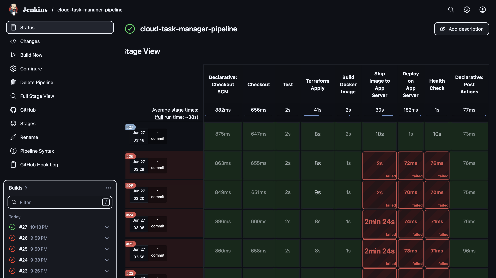
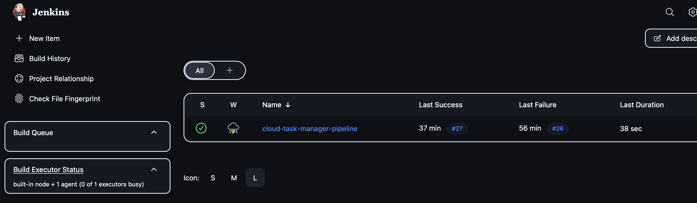
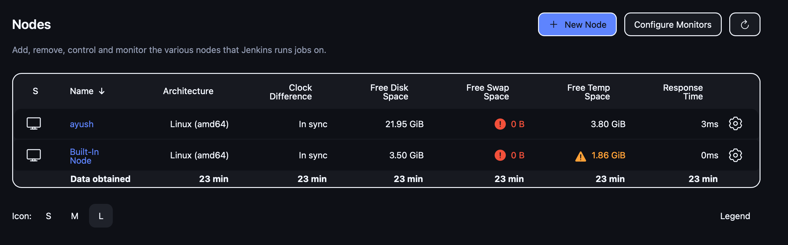
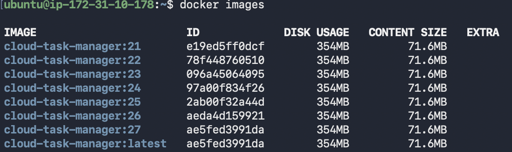
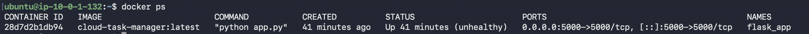
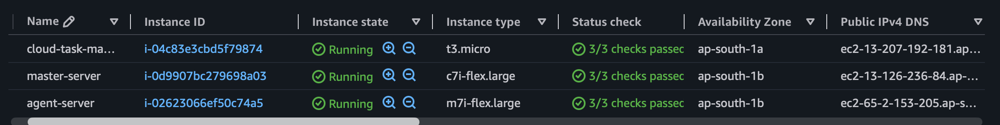
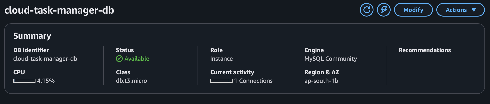
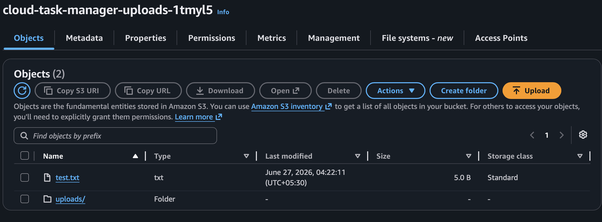
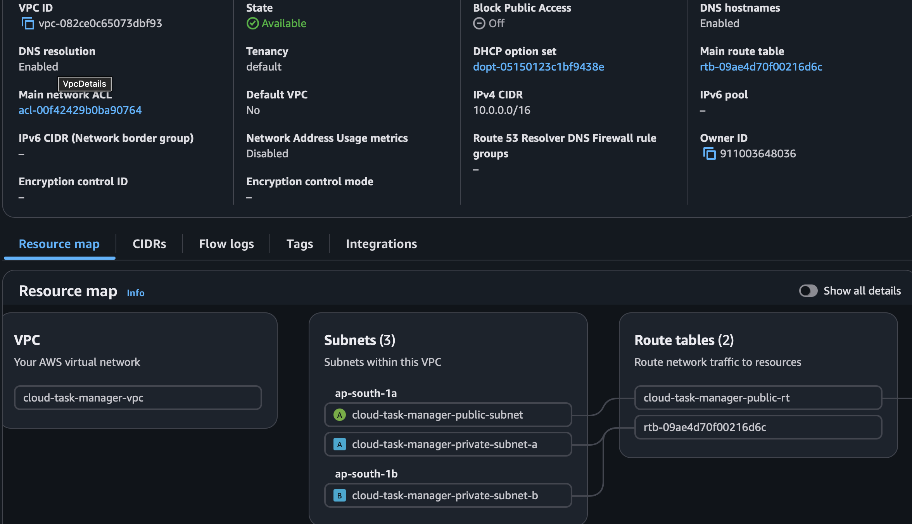
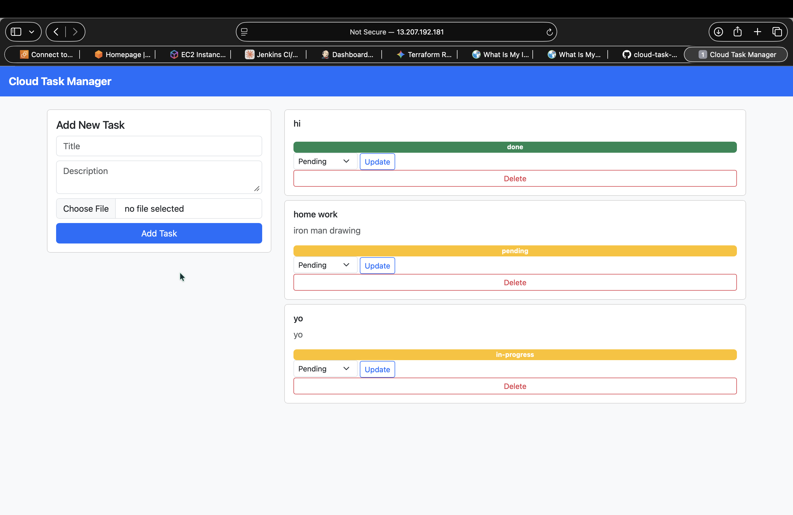

# Cloud Task Manager — CI/CD Deployment Pipeline

A Python Flask CRUD task manager deployed on AWS using a real Jenkins Controller + Build Agent architecture, with infrastructure provisioned by Terraform.

## Architecture
**System architecture — Jenkins Controller + Build Agent + App Server**
**Three-tier CI/CD architecture, separating orchestration, build, and runtime:**
 
- **Jenkins Controller** — orchestrates the pipeline. Receives GitHub webhooks, schedules jobs. No build tools installed.
- **Build Agent** — executes the pipeline. Runs Terraform (provisions infra) and Docker (builds the image), then ships the image to the App Server over SSH.
- **App Server** — runtime only. Pulls the built image and serves the application. Connects to RDS and S3.
**Flow:** `git push → GitHub webhook → Controller dispatches to Agent → Agent builds & provisions → image deployed to App Server → app live`
 
```
GitHub --(webhook)--> Jenkins Controller --(SSH agent)--> Build Node (Terraform + Docker)
                                                                  |
                                                    (build image, ship via SSH)
                                                                  v
                                                            App Server
                                                        (Flask container)
                                                            |        |
                                                       RDS MySQL    S3




- **Jenkins Controller** — 4 GB RAM / 15 GB storage. Runs Jenkins natively as a systemd service. Watches GitHub, dispatches builds.
- **Build Node** — 8 GB RAM / 29 GB storage. Registered as a Jenkins Agent. Has Terraform + Docker installed. Builds the Docker image and runs Terraform.
- **App Server** — created by Terraform. Runs the Flask container. Connects to RDS and S3.

## Tech Stack

- **Infrastructure:** Terraform (modular: ec2, security_group), AWS EC2, RDS MySQL, S3, VPC, IAM
- **CI/CD:** Jenkins (Controller/Agent architecture), Jenkinsfile (declarative pipeline), GitHub Webhooks
- **App:** Python Flask, SQLAlchemy, Boto3
- **Containers:** Docker, Docker Compose (local dev only)

## Live Demo

- App: `http://<APP_SERVER_IP>:5000`
- Jenkins: `http://<JENKINS_CONTROLLER_IP>:8080`

## Setup

1. Launch Jenkins Controller + Build Node EC2 instances
2. Install Jenkins natively on Controller; Docker + Terraform on Build Node
3. Register Build Node as a Jenkins agent over SSH
4. Configure AWS CLI on Build Node (`aws configure`)
5. Run `terraform init && terraform apply -var-file=terraform.tfvars` once manually to provision App Server, RDS, and S3
6. Push code to GitHub
7. Configure GitHub webhook pointing at the Jenkins Controller
8. Create the Jenkins pipeline job pointing at the repo
9. Future pushes trigger the pipeline automatically

## Project Structure

```
cloud-task-manager/
├── app/
│   ├── app.py
│   ├── requirements.txt
│   └── templates/
├── Dockerfile
├── docker-compose.yml      # local dev only
├── Jenkinsfile
└── terraform/
    ├── main.tf
    ├── variables.tf
    ├── outputs.tf
    └── modules/
        ├── ec2/
        └── security_group/
```

## Deployment images

### Jenkins

**Full CI/CD pipeline run**


**Jenkins dashboard — all pipeline jobs**


**Build Node registered as Jenkins Agent**


### Docker

**Docker image built on the Build Node (agent)**


**Docker container running on the App Server**


### AWS Infrastructure

**EC2 — App Server instance**


**RDS — MySQL database**


**S3 — Uploads bucket**


**VPC — Networking setup**


### Application

**Cloud Task Manager — live dashboard**


---

*Built as a portfolio project demonstrating Terraform, Jenkins Controller/Agent CI/CD, Docker, and AWS cloud architecture.*
